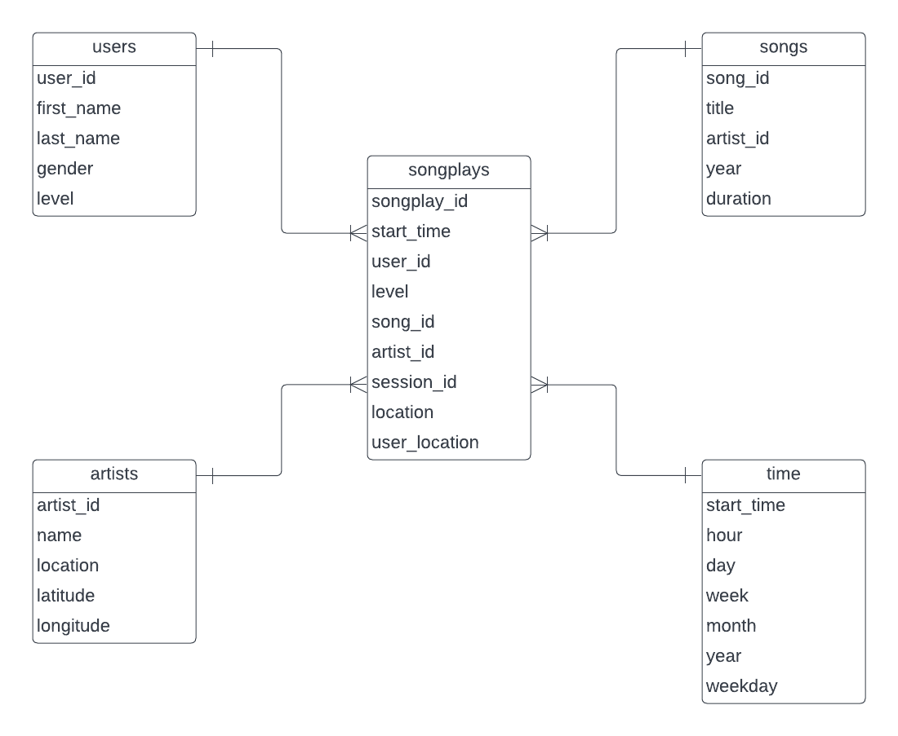

# Udacity: Data Modeling with Postgres

## Introduction

This project aims to perform data analysis on behalf of a fictional startup called Sparkify. This is a music streaming service who have user activity along with song data and wish to exploit and manipulate their users listening habits. This will be achieved using PostgreSQL.

## How to run

1. Run **create_tables.py**: Drops and creates tables.
2. Run **etl.py**: From song_data and log_data, read, process and load files/data.

**Notes:**  
test.ipynb can be used to check loaded data  
Always do Step 1 before Step 2 to reset your tables.

## File introduction
### Song Data
data/song_data  
A subset of the million song dataset.  
JSON files containing song and artist metadata.  
First 3 letters of track ID is used for partitioning the data

>{"num_songs": 1, "artist_id": "ARJIE2Y1187B994AB7", "artist_latitude": null, "artist_longitude": null, "artist_location": "", "artist_name": "Line Renaud", "song_id": "SOUPIRU12A6D4FA1E1", "title": "Der Kleine Dompfaff", "duration": 152.92036, "year": 0}

### Log Data
data/log_data
JSON files contianing simulated user activity data.  
year and month used to partition data.

**test.ipynb**  
A notebook for to check successful loading and other checks  
**create_tables.py**  
drops and creates tables needed to run etl.py  
**etl.ipynb**  
Reads and processes data from song_data and log_data.  
Only extracts from a single file but includes detailed instructions.  
**etl.py**  
Reads and processes data from song_data and log_data.  
Extracts from all of the given files.  
**sql_queries.py**  
A collection of PostgreSQL queries used in this project.  
**README.md**  
This interesting discussion.  
**project1_er.png**  
ER diagram used in this project.  

## Schema and ETL

The ER diagram corresponding to the Star Schema used in the current project is show above.  
The songplays fact table acts as a convenient and logical node between the given dimension tables.  
The dimension tables are well defined and separated allowing for a high degree of flexibility.  

Song_data is extracted, filtered and loaded into the songs and artists tables.  
Log_data is extracted and then filtered for the NextSong page value.  
The time data is then transformed to timedate and various individual values are extracted and saved.  
Values are saved to the time and user tables.  
Songplay records are extracted and completed with the aid of the songs and artists tables.  

